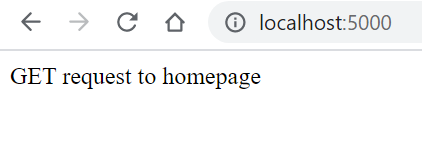
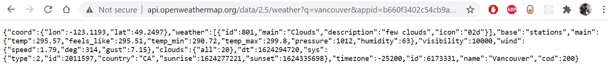
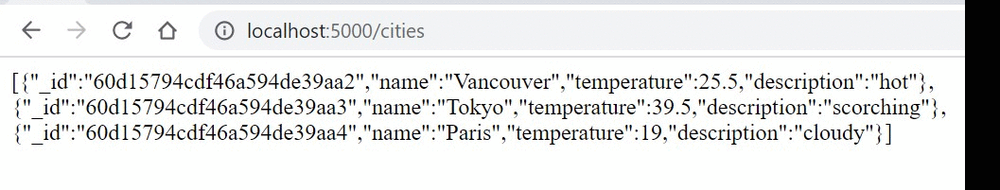
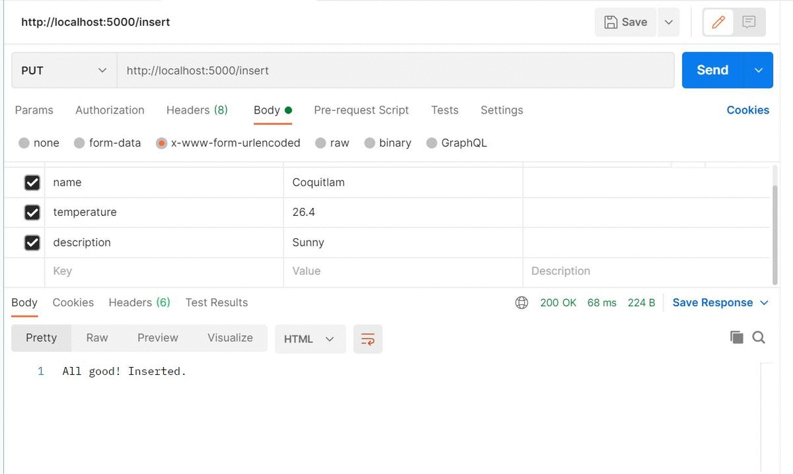
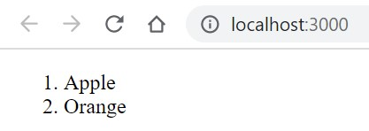

# MERN Demo (MongoDB, Express.js, React.js, and Node.js)

Here is a list of steps we are going through this Tutorial:
Table of Contents
=================

* [MERN Demo (MongoDB, Express.js, React.js, and Node.js)](#mern-demo-mongodb-expressjs-reactjs-and-nodejs)
   * [Check out the complete server code <a href="./server/server.js">here</a> and client code <a href="./client/">here</a>.](#check-out-the-complete-server-code-here-and-client-code-here)
* [Setting up The Server](#setting-up-the-server)
* [Routing in Express](#routing-in-express)
* [REST API - Round One](#rest-api---round-one)
   * [GET request from our server to external server &amp; Parsing the JSON response](#get-request-from-our-server-to-external-server--parsing-the-json-response)
   * [Handle a POST request to our server &amp; Using the body parser](#handle-a-post-request-to-our-server--using-the-body-parser)
* [MongoDB and REST API - Round Two](#mongodb-and-rest-api---round-two)
* [JS filter and map and REST API - Round Three](#js-filter-and-map-and-rest-api---round-three)
   * [to get only the temperature of a specific city.](#to-get-only-the-temperature-of-a-specific-city)
* [React and REST API - Round Four [Optional]](#react-and-rest-api---round-four-optional)

---
Check out the complete server code [here](./server/server.js) and client code [here](./client/).
---
# Setting up The Server
- Create a `server` directory using the command:
    `nabil828@DESKTOP-0AB0QNR:~/mern_demo$ mkdir server`. Now, Express.js is the framework that we will use to build the server. It is defined as
  >Fast, unopinionated, minimalist web framework for Node.js

- [[Source]](https://expressjs.com/en/starter/installing.html) Install Express using the following commands:

```
nabil828@DESKTOP-0AB0QNR:~/mern_demo/server$ npm init
This utility will walk you through creating a package.json file.
It only covers the most common items, and tries to guess sensible defaults.

See `npm help json` for definitive documentation on these fields
and exactly what they do.

Use `npm install <pkg>` afterwards to install a package and
save it as a dependency in the package.json file.

Press ^C at any time to quit.
package name: (server)
version: (1.0.0)
description:
entry point: (index.js)
test command:
git repository:
keywords:
author: NAbil
license: (ISC)
About to write to /home/nabil828/mern_demo/server/package.json:

{
  "name": "server",
  "version": "1.0.0",
  "description": "",
  "main": "index.js",
  "scripts": {
    "test": "echo \"Error: no test specified\" && exit 1"
  },
  "author": "NAbil",
  "license": "ISC"
}


Is this OK? (yes)
nabil828@DESKTOP-0AB0QNR:~/mern_demo/server$ npm install express --save
npm notice created a lockfile as package-lock.json. You should commit this file.
npm WARN server@1.0.0 No description
npm WARN server@1.0.0 No repository field.

+ express@4.17.1
added 50 packages from 37 contributors and audited 50 packages in 4.488s
found 0 vulnerabilities
```

- Open the server folder using atom `atom ~/mern_demo/server` and create a new file `server.js`

- change the entry point to `server.js` in the `package.josn` file. This the home page of the server when it the http://localhost:port url s requested.  

- [[Source]](https://expressjs.com/en/5x/api.html#express) Create an Express.js application by copying these two line

```js
const express = require('express')
const app = express()
```
into your server.js .

- [[Source]](https://expressjs.com/en/5x/api.html#app.listen) Assign port 5000 to the server using the following code:

```js
app.listen(5000)
```
**OR** even better, add a call back function as a second argument to the previous `listen` function so we can print out any errors on the run time:

```js
app.listen(5000, function(err){
  if(err) console.log(err);
  })
```

- start the server by typing `$node server.js`
**OR** even better, use `$nodemon server.js` to keep the server running while you are making edits. To install [`nodemon`](https://www.npmjs.com/package/nodemon), run `npm install -g nodemon`.

- Test the server by visiting `http://localhost:5000` in your browser.
You should get the following output:
  
We will fix the server to accept GET request soon 😉.

- You may now add a handle for GET requests:

```js
app.get('/', function (req, res) {
  res.send('GET request to homepage')
})
```
The first argument is the relative path to server homepage.
The second argument is a call function the will hold the `req` variable for the request object. And the `res` variable for the response object. We use the method `res.send()` to send a message back to the client:

  
You may even embed HTML in your response's string.

---

# Routing in Express
So far we had one route to our server. Namely, the '/' route. If we want clients to visit other ~~pages~~ routes, we can handle these requests in such a way:

```js
app.get('/contact', function (req, res) {
  res.send('Hi there, here is my <a href="mailto:nabil@eceubc.ca"> email </a>.')
})
```

Output:

  

Use the following to add `./public` folder for  static assets in your site.

```js
app.use(express.static('./public'));
````

# REST API - Round One
> [[Source]](https://rapidapi.com/blog/most-popular-api/) API stands for Application Programming Interface and allows your application to interact with an external service using a simple set of commands.

out of 10,000 APIs out there in the wild, we will be interacting with the [[openweathermap]](https://openweathermap.org/api) API to get weather and weather forecasts for multiple cities. Our Express server will act as client in this interaction. [REST](https://en.wikipedia.org/wiki/Representational_state_transfer) stands for Representational state transfer which is an architectural stateless style to make designing web apps more scalable and secure.  
- Create a free account on [[openwathermap]](https://openweathermap.org/price) website.
- [[API call guide]](https://openweathermap.org/current) Using your API key, test an API call by pasting this link into the browser, replacing the API key with yours:

```
api.openweathermap.org/data/2.5/weather?q={city name}&appid={API key}
```

Here is the formatted JSON reply from the API server([[Using pretty-json package in Atom]](https://atom.io/packages/pretty-json)):

```json
{
  "coord": {
    "lon": -123.1193,
    "lat": 49.2497
  },
  "weather": [
    {
      "id": 801,
      "main": "Clouds",
      "description": "few clouds",
      "icon": "02d"
    }
  ],
  "base": "stations",
  "main": {
    "temp": 295.57,
    "feels_like": 295.51,
    "temp_min": 290.72,
    "temp_max": 299.8,
    "pressure": 1012,
    "humidity": 63
  },
  "visibility": 10000,
  "wind": {
    "speed": 1.79,
    "deg": 314,
    "gust": 7.15
  },
  "clouds": {
    "all": 20
  },
  "dt": 1624294720,
  "sys": {
    "type": 2,
    "id": 2011597,
    "country": "CA",
    "sunrise": 1624277221,
    "sunset": 1624335698
  },
  "timezone": -25200,
  "id": 6173331,
  "name": "Vancouver",
  "cod": 200
}
```
## GET request from our server to external server & Parsing the JSON response
With the help [[HTTPS module]](https://nodejs.org/api/https.html#https_https_get_url_options_callback) in Node.js we will make a GET request to this API to get Vancouver weather.

```js
const https = require('https');

app.get("/", function(req, res) {
  var cityName = 'Vancouver';
  var apikey = "b660f3402c54cb9a9c48f89c35249e5c"
  const url = "https://api.openweathermap.org/data/2.5/weather?q=" + cityName + "&units=metric&appid=" + apikey

  https.get(url, function(https_res) {
      https_res.on("data", function(data) {  
      res.write("<h1> " + cityName + " weather is " + JSON.parse(data).weather[0].description) + "</h1>";
      res.write("<h1> " + cityName + " temp is " + JSON.parse(data).main.temp) + "</h1>";

      // console.log(JSON.parse(data).weather[0].icon );
      res.write('  ");
      res.send();
    })
  });

})
```

Notice how we use `res.write` multiple times to before calling `res.send`. Check the top answer in this [[stackoverflow post]](https://stackoverflow.com/questions/44692048/what-is-the-difference-between-res-send-and-res-write-in-express) to understand the difference between `res.write` and `res.send`. The key difference is `res.send` can be called only once where as `res.write` can be called multiple times followed by a `res.end`.


## Handle a POST request to our server & Using the body parser
Before continuing check and compare the browse the [base code so far](https://github.com/nabil828/mern_demo/tree/d02e63cdc6fc1b06be68c682a8df3a51514d084f).

Now, we want to enable the user to enter a city name and get live weather data from the openwathermap API through our server. Something like this:


- First, we will be changing the `app.get('/')` to return an html file instead of an html code and move the previous code in `app.get('/')` to `app.post('/')` as such:

```js
app.get('/', function(req, res) {
  res.sendFile(__dirname + "/index.html");
})

app.post("/", function(req, res) {
  // res.send("post req received" + req.body.cityName);
  var apikey = "b660f3402c54cb9a9c48f89c35249e5c";
  const url = "https://api.openweathermap.org/data/2.5/weather?q=" + req.body.cityName + "&units=metric&appid=" + apikey

  https.get(url, function(https_res) {
    https_res.on("data", function(data) {
      res.write("<h1> " + req.body.cityName + " weather is " + JSON.parse(data).weather[0].description) + "</h1>";
      res.write("<h1> " + req.body.cityName + " temp is " + JSON.parse(data).main.temp) + "</h1>";

      // console.log(JSON.parse(data).weather[0].icon );
      res.write('  ");
      res.send();
    })
  });

})


```
Notice how we are sending now `index.html` file back to the browser client whenever it sends a GET for the root directory of our web server. Here is the content of `index.html`:

```html
<!DOCTYPE html>
<html lang="en" dir="ltr">
  <head>
    <meta charset="utf-8">
    <title> Live Weather Application</title>
  </head>
  <body>
    <h1> Enter City Name:</h1>

    <form method="post">

      <label> City Name</label>

      <input type="text" name="cityName" placeholder="Enter City Name">
      <input type="submit" value="submit">
    </form>

  </body>
</html>

```
Also, notice that we are using now `res.sendFile()` instead of `res.send()` to send a whole html file. In `index.html`, we have built a simple form for the user to enter the city of interest.
Once the user hit button, a POST request will be send to our server and will be caught by `app.post('/')`. Again, the argument `/` indicates that the POST request was originated from the root/home page.

- Next, we need to parse the POST request using [`body-parser`](https://www.npmjs.com/package/body-parser) module. It allows us to use the property `req.body` to get the entered city name.
copy the next lines at the begining of `server.js`:

```js
const bodyparser = require("body-parser");
app.use(bodyparser.urlencoded({
  extended: true
}));
```
check out [[https://www.npmjs.com/package/body-parser]](https://www.npmjs.com/package/body-parser) for full documentation of this module/middleware.

- Finally, add the API key from your openweathermap account page.

```js
const apikey = "b660f3402c54cb9a9c48f89c35249e5c";
```
run `http://localhost:5000` on your server and Voila!
[Check out the code at this stage](https://github.com/nabil828/mern_demo/tree/e67c18b706c68bb03b9ded771ae29549836ff882) .


# MongoDB and REST API - Round Two
Before talking about the other REST operations, namely PUT and DELETE, let us build a database on our server to serve such requests. Now, we want to build our own weather service and not make any calls to openwathermap.

- First, let us install mongodb using our terminal

```
sudo apt-get install mongodb
```  
and run the mongodb service Using

```
sudo service mongodb start
```
and log in to the database terminal using

```
$ mongo
```
command.

- Next, create and use `test` db using

```
use test
```
and create and populate `cities` collection using

```js
> db.cities.insert([{name:'Vancouver', tempreture:25.5, description:'hot'},{name:'Tokyo', tempreture:39.5, description:'scorching'},{name:'Paris', tempreture:'19', description:'cloudy'}]);
BulkWriteResult({
        "writeErrors" : [ ],
        "writeConcernErrors" : [ ],
        "nInserted" : 3,
        "nUpserted" : 0,
        "nMatched" : 0,
        "nModified" : 0,
        "nRemoved" : 0,
        "upserted" : [ ]
})
> db.cities.find().pretty();
{
        "_id" : ObjectId("60d15794cdf46a594de39aa2"),
        "name" : "Vancouver",
        "temperature" : 25.5,
        "description" : "hot"
}
{
        "_id" : ObjectId("60d15794cdf46a594de39aa3"),
        "name" : "Tokyo",
        "temperature" : 39.5,
        "description" : "scorching"
}
{
        "_id" : ObjectId("60d15794cdf46a594de39aa4"),
        "name" : "Paris",
        "temperature" : "19",
        "description" : "cloudy"
}
```
Now the database is created and running. We now need to access it through the Express server.

- Install [`mongoose`](https://mongoosejs.com/docs/) module to enable us to access mongodb from the server code.

```js
const mongoose = require('mongoose');

mongoose.connect("mongodb://localhost:27017/test",
 {useNewUrlParser: true, useUnifiedTopology: true});
const citySchema = new mongoose.Schema({
    name: String,
    temperature: Number,
    description: String
});
const cityModel = mongoose.model("cities", citySchema);
```
The `mongoose.connect` function call will establish the connection to the db. The `citySchema` variabale should match the schema of your collection in the mongodb. The `cityModel` object is going to be used to help us to mimic passing SQL queries to the db.

- Now moving to the fun part. Let us add these *routes* in the server code to match, a GET(retrieve all), GET(retrieve one), POST(insert one), PUT(update one), & DELETE(delete all/one) requests.  

Something along these lines:

```js
app.use(bodyParser.json());

app.get('/cities', (req, res) => {
  const cities = [];
  // code to retrieve all cities...
  res.json(cities);
});

app.post('/cities', (req, res) => {
  // code to add a new city...
  res.json(req.body);
});

app.put('/cities/:name', (req, res) => {
  const { name } = req.params;
  // code to update a city...
  res.json(req.body);
});

app.delete('/cities/:name', (req, res) => {
  const { name } = req.params;
  // code to delete a city...
  res.json({ deleted: id });
});
```
Note how these REST API calls will match the SELECT, INSERT, UPDATE, & DELETE statements. Also, notice how do we retrieve the city name from URL route using the `req.params` [[Source]](https://stackoverflow.blog/2020/03/02/best-practices-for-rest-api-design/).

Here are the routes I implemented:

```js
app.get('/cities/:city_name', function(req, res) {
  console.log("received a request for "+ req.params.city_name);
  cityModel.find({name: req.params.city_name}, function(err, cities){
      if (err){
        console.log("Error " + err);
      }else{
        console.log("Data "+ JSON.stringify(cities));
      }
      res.send(JSON.stringify(cities));
  });
})
app.get('/cities', function(req, res) {
  cityModel.find({}, function(err, cities){
      if (err){
        console.log("Error " + err);
      }else{
        console.log("Data "+ JSON.stringify(cities));
      }
      res.send(JSON.stringify(cities));
  });
})
```

This will enable the client for example to list all cities and browse a city by its name:


- To save time in building front-end HTML forms to trigger `app.put("/insert")` & `app.delete("/delete")` to matching the following routes:

```js
app.put("/insert", function(req, res){
  cityModel.create({
    name : req.body.name,
    temperature : req.body.temperature,
    description: req.body.description
  }, function(err, data){
    if(err) console.log(err);
    else
    console.log(data);
    res.send("All good! Inserted.")
  });
})
app.delete("/delete/:city_name", function(req, res){
  cityModel.remove({
    name : req.body.name
  }, function(err, data){
    if(err) console.log(err);
    else
    console.log(data);
    res.send("All good! Delteted.")
  });
})
```
, we will use a tool called [[Postman]](https://www.postman.com/) to simulate these requests. In the following gif, I am inserting a new city and deleting it using the API.


Check the status of the [code](https://github.com/nabil828/mern_demo/tree/b24a6704d141f6c7fb72dd03f5efee3e58f6e133) at this stage.

--

# JS filter and map and REST API - Round Three
Create `data.js` file to have the following data:

```js
json_cities = {
    "list": [
        {
            "name": "Vancouver",
            "tempreture": 25.5,
            "description": "hot"
        },
        {
            "name": "Tokyo",
            "tempreture": 39.5,
            "description": "scorching"
        },
        {
            "name": "Paris",
            "tempreture": "19",
            "description": "cloudy"
        }
    ]
}

module.exports = json_cities
```
Try out the following routes

```js
json_cities = require('./data.js');

app.get('/cities_from_json_file', function (req, res) {
  res.send(json_cities.list);
})

```
to get all the cirties.

And

```js

app.get('/cities_from_json_file/:city_name', function (req, res) {

  res.send(json_cities.list.filter(function(i_){
    return i_.name == req.params.city_name;
  }));

})

```
to get the weather for a specific city.

and

```js
function map_f(i_) {
  return i_["tempreture"]

}
app.get('/cities_from_json_file/:city_name', function (req, res) {

  res.send(json_cities.list.filter(function(i_){
    return i_.name == req.params.city_name;
  }).map(map_f));

})

```
to get only the temperature of a specific city.

---

# React and REST API - Round Four [Optional]
Now our server is ready to serve but what about our client. So far we had been testing the server by mostly entering the routes directly in the browser for GET requests and using Postman for the PUT & DELETE.

We will create a simple client interface using [React.js](https://reactjs.org/) to get client like the following:


by clicking on these two react links, each city weather is going to be loaded into the page without the page getting reloaded. All the magic will happen in the background. React will contact the Express server and retrieve the weather of the selected city.

- [[Source]](https://reactjs.org/docs/create-a-new-react-app.html) First, we need to create another directory by executing the following:

```
npx create-react-app client
cd client
npm start
```
It took me around 4 minutes and here is what I got from running it:

```
nabil828@DESKTOP-0AB0QNR:~/mern_demo$ ls client/
nabil828@DESKTOP-0AB0QNR:~/mern_demo$ npx create-react-app client
npx: installed 67 in 4.035s

Creating a new React app in /home/nabil828/mern_demo/client.

Installing packages. This might take a couple of minutes.
Installing react, react-dom, and react-scripts with cra-template...


> core-js@2.6.12 postinstall /home/nabil828/mern_demo/client/node_modules/babel-runtime/node_modules/core-js
> node -e "try{require('./postinstall')}catch(e){}"


> core-js@3.15.0 postinstall /home/nabil828/mern_demo/client/node_modules/core-js
> node -e "try{require('./postinstall')}catch(e){}"


> core-js-pure@3.15.0 postinstall /home/nabil828/mern_demo/client/node_modules/core-js-pure
> node -e "try{require('./postinstall')}catch(e){}"


> ejs@2.7.4 postinstall /home/nabil828/mern_demo/client/node_modules/ejs
> node ./postinstall.js

+ cra-template@1.1.2
+ react-scripts@4.0.3
+ react-dom@17.0.2
+ react@17.0.2
added 1897 packages from 703 contributors and audited 1900 packages in 87.361s

145 packages are looking for funding
  run `npm fund` for details

found 7 vulnerabilities (3 moderate, 4 high)
  run `npm audit fix` to fix them, or `npm audit` for details

Installing template dependencies using npm...
npm WARN @babel/plugin-bugfix-v8-spread-parameters-in-optional-chaining@7.14.5 requires a peer of @babel/core@^7.13.0 but none is installed. You must install peer dependencies yourself.
npm WARN tsutils@3.21.0 requires a peer of typescript@>=2.8.0 || >= 3.2.0-dev || >= 3.3.0-dev || >= 3.4.0-dev || >= 3.5.0-dev || >= 3.6.0-dev || >= 3.6.0-beta || >= 3.7.0-dev || >= 3.7.0-beta but none is installed. You must install peer dependencies yourself.
npm WARN optional SKIPPING OPTIONAL DEPENDENCY: fsevents@2.3.2 (node_modules/fsevents):
npm WARN notsup SKIPPING OPTIONAL DEPENDENCY: Unsupported platform for fsevents@2.3.2: wanted {"os":"darwin","arch":"any"} (current: {"os":"linux","arch":"x64"})
npm WARN optional SKIPPING OPTIONAL DEPENDENCY: fsevents@1.2.13 (node_modules/watchpack-chokidar2/node_modules/fsevents):
npm WARN notsup SKIPPING OPTIONAL DEPENDENCY: Unsupported platform for fsevents@1.2.13: wanted {"os":"darwin","arch":"any"} (current: {"os":"linux","arch":"x64"})
npm WARN optional SKIPPING OPTIONAL DEPENDENCY: fsevents@1.2.13 (node_modules/webpack-dev-server/node_modules/fsevents):
npm WARN notsup SKIPPING OPTIONAL DEPENDENCY: Unsupported platform for fsevents@1.2.13: wanted {"os":"darwin","arch":"any"} (current: {"os":"linux","arch":"x64"})

+ web-vitals@1.1.2
+ @testing-library/jest-dom@5.14.1
+ @testing-library/user-event@12.8.3
+ @testing-library/react@11.2.7
added 29 packages from 78 contributors and audited 1929 packages in 11.566s

145 packages are looking for funding
  run `npm fund` for details

found 7 vulnerabilities (3 moderate, 4 high)
  run `npm audit fix` to fix them, or `npm audit` for details
Removing template package using npm...

npm WARN @babel/plugin-bugfix-v8-spread-parameters-in-optional-chaining@7.14.5 requires a peer of @babel/core@^7.13.0 but none is installed. You must install peer dependencies yourself.
npm WARN tsutils@3.21.0 requires a peer of typescript@>=2.8.0 || >= 3.2.0-dev || >= 3.3.0-dev || >= 3.4.0-dev || >= 3.5.0-dev || >= 3.6.0-dev || >= 3.6.0-beta || >= 3.7.0-dev || >= 3.7.0-beta but none is installed. You must install peer dependencies yourself.
npm WARN optional SKIPPING OPTIONAL DEPENDENCY: fsevents@1.2.13 (node_modules/webpack-dev-server/node_modules/fsevents):
npm WARN notsup SKIPPING OPTIONAL DEPENDENCY: Unsupported platform for fsevents@1.2.13: wanted {"os":"darwin","arch":"any"} (current: {"os":"linux","arch":"x64"})
npm WARN optional SKIPPING OPTIONAL DEPENDENCY: fsevents@2.3.2 (node_modules/fsevents):
npm WARN notsup SKIPPING OPTIONAL DEPENDENCY: Unsupported platform for fsevents@2.3.2: wanted {"os":"darwin","arch":"any"} (current: {"os":"linux","arch":"x64"})
npm WARN optional SKIPPING OPTIONAL DEPENDENCY: fsevents@1.2.13 (node_modules/watchpack-chokidar2/node_modules/fsevents):
npm WARN notsup SKIPPING OPTIONAL DEPENDENCY: Unsupported platform for fsevents@1.2.13: wanted {"os":"darwin","arch":"any"} (current: {"os":"linux","arch":"x64"})

removed 1 package and audited 1928 packages in 8.664s

145 packages are looking for funding
  run `npm fund` for details

found 7 vulnerabilities (3 moderate, 4 high)
  run `npm audit fix` to fix them, or `npm audit` for details

Success! Created client at /home/nabil828/mern_demo/client
Inside that directory, you can run several commands:

  npm start
    Starts the development server.

  npm run build
    Bundles the app into static files for production.

  npm test
    Starts the test runner.

  npm run eject
    Removes this tool and copies build dependencies, configuration files
    and scripts into the app directory. If you do this, you can’t go back!

We suggest that you begin by typing:

  cd client
  npm start

Happy hacking!
nabil828@DESKTOP-0AB0QNR:~/mern_demo$ cd client/
nabil828@DESKTOP-0AB0QNR:~/mern_demo/client$ l
README.md  node_modules/  package-lock.json  package.json  public/  src/
nabil828@DESKTOP-0AB0QNR:~/mern_demo/client$ ls
README.md  node_modules  package-lock.json  package.json  public  src
```

Notice the new files added by the `npx` command and how it suggests to use `npm start` to start the client.

- Before we move forward, check out the tree structure of the automatically created files:

```
nabil828@DESKTOP-0AB0QNR:~/mern_demo/client$ tree . -L 1
.
├── README.md
├── node_modules
├── package-lock.json
├── package.json
├── public
└── src

3 directories, 3 files
nabil828@DESKTOP-0AB0QNR:~/mern_demo/client$ tree ./src -L 1
./src
├── App.css
├── App.js
├── App.test.js
├── index.css
├── index.js
├── logo.svg
├── reportWebVitals.js
└── setupTests.js

0 directories, 8 files
nabil828@DESKTOP-0AB0QNR:~/mern_demo/client$ tree ./public -L 1
./public
├── favicon.ico
├── index.html
├── logo192.png
├── logo512.png
├── manifest.json
└── robots.txt

0 directories, 6 files
nabil828@DESKTOP-0AB0QNR:~/mern_demo/client$
```
The action starts with `index.js` in the `src` directory. I will open the `client` directory in atom and delete all the files except `index.js` and `index.html`:

```
nabil828@DESKTOP-0AB0QNR:~/mern_demo/client$ ls
README.md  node_modules  package-lock.json  package.json  public  src
nabil828@DESKTOP-0AB0QNR:~/mern_demo/client$ cd public/
nabil828@DESKTOP-0AB0QNR:~/mern_demo/client/public$ ls
favicon.ico  index.html  logo192.png  logo512.png  manifest.json  robots.txt
nabil828@DESKTOP-0AB0QNR:~/mern_demo/client/public$ rm favicon.ico
nabil828@DESKTOP-0AB0QNR:~/mern_demo/client/public$ rm logo*
nabil828@DESKTOP-0AB0QNR:~/mern_demo/client/public$ ls
index.html  manifest.json  robots.txt
nabil828@DESKTOP-0AB0QNR:~/mern_demo/client/public$ rm robots.txt
nabil828@DESKTOP-0AB0QNR:~/mern_demo/client/public$ rm manifest.json
nabil828@DESKTOP-0AB0QNR:~/mern_demo/client/public$ ls
index.html
nabil828@DESKTOP-0AB0QNR:~/mern_demo/client/public$ cd ..
nabil828@DESKTOP-0AB0QNR:~/mern_demo/client$ cd ..
nabil828@DESKTOP-0AB0QNR:~/mern_demo$ tree ./public -L 1
./public [error opening dir]

0 directories, 0 files
nabil828@DESKTOP-0AB0QNR:~/mern_demo$ tree ./public
./public [error opening dir]

0 directories, 0 files
nabil828@DESKTOP-0AB0QNR:~/mern_demo$ cd client/
nabil828@DESKTOP-0AB0QNR:~/mern_demo/client$ tree ./public -L 1
./public
└── index.html

0 directories, 1 file
nabil828@DESKTOP-0AB0QNR:~/mern_demo/client$ tree ./src -L 1
./src
└── index.js

0 directories, 1 file
```

Alright, so we are left with `src/index.js`& `public/index.html`

- Next, I will clean `index.js` to have only the following lines:

```
import React from 'react';
import ReactDOM from 'react-dom';


ReactDOM.render(
    <ol>
      <li> Apple </li>
      <li> Orange </li>
    </ol>
    ,
    document.getElementById('root')
);
```

In this snippet of code, we are calling `ReactDOM.render` which takes two arguments; what to render and where to render.
This code we will render an ordered list inside an HTML element with an ID equal to `root`. If you check `public/index.html`, you will see that it is a `div` element inside the body html element with the id `root`:

```
  <div id="root"></div>
```
So that is it. We now have a simple, clean, & working React client:


- Now I want to show you the final state of my code and go over it in more details.

- Create `App.js` file and have this code copied inside it:

```
import {Route,Switch, BrowserRouter, Link} from "react-router-dom"
import {useState, useEffect} from 'react'

function Heading(){
  return (<h1> Weather webservice </h1>);
}

function Card(props){
  const [city, setCity] = useState(null);
  console.log("props.name" + props.name);
  useEffect( () => {
    fetch("/cities/" + props.name)
    .then(response => response.json())
    .then(data => setCity(data[0]))
  },[props.name]
  )


  console.log(city);
      if(city){
        return (
          <>
            <h1> {city.name} </h1>
            <ul>
              <li> Temperature: {city.temperature}</li>
              <li> Description: {city.description}</li>
            </ul>
          </>
        );
      }else
      return <h1> No User</h1>

}
function App() {
  return (
    <div>
      <Heading/>

      Select a city:
      <ul>
        <li><Link to="/Vancouver"> Vancouver </Link> </li>
        <li><Link to="/Tokyo"> Tokyo </Link> </li>
      </ul>

        <Switch>
        <Route
          path="/Vancouver"
          render={(props) => (
             <Card name='Vancouver'/>
           )}
        />
        <Route
          path="/Tokyo"
          render={(props) => (
             <Card name='Tokyo'/>
           )}
        />

      </Switch>
    </div>

  );
}
export default App;
```
And modify `index.js` to match the following:
```
import App from "./App.js";
import {BrowserRouter} from 'react-router-dom';

var React = require('react');
var ReactDom = require("react-dom");


ReactDom.render(
  <BrowserRouter>
  <App/>
  </BrowserRouter>
  , document.getElementById("root"));
```
This is it!
Let us break this code down:
 - First, notice in `index.js` how we surrounded the `App` tag with `BrwoserRouter` tag.
 `BrwoserRouter` indicates that you plan to use react routes in your client. Check [react-router-dom](https://reactrouter.com/web/guides/quick-start) and install it in the `client` directory. This will allow us, for example
 to select and load the weather for different cities.
 - As for the `App` tag itself, notice how the letter A is in capital case. This is not an ordinary HTML tag. It is a special React.js tag
 called a *component*. Think about the user interface (UI) as a group of independent components.
 - Now we choose to write the code of the `App` component in a separate file but it is not a must.
 - In the `App.js` file we have two functions
  - `App()` is the function that going to return the HTML code the that would replace the `App` tag. We can that first we build a simple navigation list with a special tag called `Link` instead of the usual `a` in HTML. This `Link` tag will allow us to make AJAX requests to update the page without reloading it. Hence a finer and faster rendering! Here is navigation page build inside the `App` component:
  ```
  Select a city:
  <ul>
    <li><Link to="/Vancouver"> Vancouver </Link> </li>
    <li><Link to="/Tokyo"> Tokyo </Link> </li>
  </ul>
  ```
  Next, we have the
  ```
  <Switch>
  <Route>
  ```
  code which will handle client routes to the paths `/Vancouver` & `/Tokyo` by *again* calling another component named `Card` and passing the city names using an argument called `props`.

  - `Card()` is the function that will return the HTML of the `Card` component. Here we want to list the city name, temperature, and description of the city's weather.
    - First, we are using [`fetch()`](https://developer.mozilla.org/en-US/docs/Web/API/Fetch_API/Using_Fetch) to construct an HTTP GET request to our server and pass the city name that we are interested in. You may use it for any other REST request like POST, PUT, or DELETE.
    - If you are asking your self: how would the `fetch()` method find the IP address and the port number of the server, then you are asking the right question. Because it can not communicate with the server without us directing clint to address of the server by add this line the `package.json` file just before the dependencies `"proxy" : "http://localhost:5000/",`
    - Second, we are using `useState` Hook to pass the response from the server to the HTML code (Aka maintaining state) [[Source]](https://reactjs.org/docs/hooks-intro.html).
    - Third, we use `useEffect` Hook is used to execute functions after a component gets rendered to “perform side effects”.
     Here, to `fetch` the server every time the user call the `Card` component passing different `props` argument [TL;DR](https://stackoverflow.com/a/55481525/2452907).  

Mmm.. and that is it I guess. Please let me know if you have any questions!
<br>
More Sources: [1](http://forum.espruino.com/conversations/1364/)

---

<!-- ## Check Your Understanding

*Props* let you split the UI into independent, reusable pieces, and think about each piece in isolation.
<details><summary>Answer</summary>

FALSE, this is the definition of Components. Read more about components and props [here](https://reactjs.org/docs/components-and-props.html).

</details> -->


Thanks,
<br/>
Nabil
